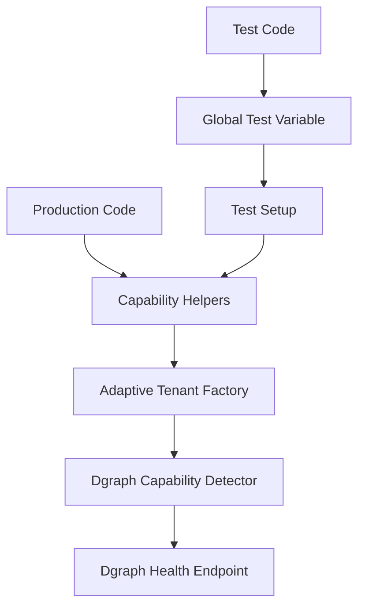

# Enterprise Capability Detection Guide

This guide explains the standardized approach for detecting and using Dgraph Enterprise capabilities across the MakeItMakeSense.io codebase.

## Overview

The application supports both Dgraph OSS and Enterprise deployments with automatic capability detection. All production code uses a **standardized pattern** to ensure consistent behavior and prevent runtime failures.

## Standardized Pattern

### For Production Code

**✅ CORRECT - Use capability helpers:**

```typescript
import { capabilityHelpers } from '../utils/capabilityHelpers';

// Check if Enterprise features are available
if (capabilityHelpers.isEnterpriseAvailable()) {
  // Enterprise-specific logic
}

// Check if multi-tenant support is available
if (capabilityHelpers.isMultiTenantSupported()) {
  // Multi-tenant logic
}

// Require capabilities with descriptive errors
capabilityHelpers.requiresMultiTenant('tenant creation');

// Get deployment mode for responses
const mode = capabilityHelpers.getDeploymentMode();
```

**❌ INCORRECT - Don't use these patterns:**

```typescript
// DON'T: Direct capability detector usage
const capabilities = await dgraphCapabilityDetector.detectCapabilities();

// DON'T: Direct adaptive factory usage (except in capability helpers)
const capabilities = adaptiveTenantFactory.getCapabilities();

// DON'T: Global test variables in production
if ((global as any).DGRAPH_ENTERPRISE_AVAILABLE) { /* ... */ }
```

### For Test Code

Tests use a separate but aligned pattern:

```typescript
// Use global test variable for conditional test execution
const conditionalDescribe = (global as any).DGRAPH_ENTERPRISE_AVAILABLE ? describe : describe.skip;

conditionalDescribe('Enterprise-only tests', () => {
  // Tests that require Enterprise features
});
```

## Available Utility Functions

### Core Capability Checks

```typescript
// Check if Enterprise features are detected and active
capabilityHelpers.isEnterpriseAvailable(): boolean

// Check if namespace isolation is supported
capabilityHelpers.isMultiTenantSupported(): boolean

// Get current capabilities (synchronous)
capabilityHelpers.getCapabilitiesSync(): TenantCapabilities | null
```

### Requirement Functions

```typescript
// Throw descriptive error if Enterprise not available
capabilityHelpers.requiresEnterprise(operation: string): void

// Throw descriptive error if multi-tenant not supported
capabilityHelpers.requiresMultiTenant(operation: string): void
```

### Utility Functions

```typescript
// Get deployment mode string
capabilityHelpers.getDeploymentMode(): string
// Returns: 'enterprise-multi-tenant' | 'enterprise-single-tenant' | 'oss-single-tenant'

// Check if detection has completed
capabilityHelpers.isCapabilityDetectionComplete(): boolean

// Get detection error if any
capabilityHelpers.getCapabilityDetectionError(): string | undefined

// Ensure capabilities are detected (async)
capabilityHelpers.ensureCapabilitiesDetected(): Promise<TenantCapabilities>
```

## Usage Examples

### Controller Example

```typescript
import { capabilityHelpers } from '../utils/capabilityHelpers';

export class TenantController {
  async createTenant(req: Request, res: Response): Promise<void> {
    try {
      const { tenantId } = req.body;
      
      // Use standardized capability check
      if (!capabilityHelpers.isMultiTenantSupported()) {
        res.status(400).json({
          error: 'Multi-tenant mode not supported in OSS deployment',
          mode: capabilityHelpers.getDeploymentMode()
        });
        return;
      }
      
      // Proceed with tenant creation
      const namespace = await this.tenantManager.createTenant(tenantId);
      
      res.status(201).json({
        tenantId,
        namespace,
        mode: capabilityHelpers.getDeploymentMode()
      });
    } catch (error) {
      next(error);
    }
  }
}
```

### Route Example

```typescript
import { capabilityHelpers, ensureCapabilitiesDetected } from '../utils/capabilityHelpers';

router.get('/system/status', async (req: Request, res: Response) => {
  try {
    // Ensure capabilities are detected
    const capabilities = await ensureCapabilitiesDetected();
    
    const systemStatus = {
      dgraphEnterprise: capabilityHelpers.isEnterpriseAvailable(),
      multiTenantVerified: capabilityHelpers.isMultiTenantSupported(),
      mode: capabilityHelpers.getDeploymentMode(),
      detectedAt: capabilities.detectedAt,
      detectionError: capabilityHelpers.getCapabilityDetectionError()
    };
    
    res.json(systemStatus);
  } catch (error) {
    res.status(500).json({ error: 'Failed to get system status' });
  }
});
```

## Error Messages

The capability helpers provide descriptive error messages:

### Enterprise Required
```
Operation 'tenant creation' requires Dgraph Enterprise features which are not available. 
Please ensure you are running Dgraph Enterprise with a valid license.
```

### Multi-Tenant Required (OSS)
```
Operation 'namespace isolation' requires multi-tenant support which is not available. 
Reason: Dgraph Enterprise is not available. Please ensure you are running Dgraph Enterprise with namespace support.
```

### Multi-Tenant Required (Enterprise without namespaces)
```
Operation 'namespace isolation' requires multi-tenant support which is not available. 
Reason: namespace isolation is not functional. Please ensure you are running Dgraph Enterprise with namespace support.
```

## Deployment Modes

The system automatically detects and reports deployment modes:

- **`enterprise-multi-tenant`**: Full Enterprise with namespace support
- **`enterprise-single-tenant`**: Enterprise without namespace support  
- **`oss-single-tenant`**: Open source deployment

## Migration Guide

### From Direct Capability Detector

**Before:**
```typescript
const capabilities = await dgraphCapabilityDetector.detectCapabilities();
if (capabilities.enterpriseDetected) {
  // Enterprise logic
}
```

**After:**
```typescript
if (capabilityHelpers.isEnterpriseAvailable()) {
  // Enterprise logic
}
```

### From Adaptive Factory

**Before:**
```typescript
const capabilities = adaptiveTenantFactory.getCapabilities();
if (capabilities?.namespacesSupported) {
  // Multi-tenant logic
}
```

**After:**
```typescript
if (capabilityHelpers.isMultiTenantSupported()) {
  // Multi-tenant logic
}
```

## Best Practices

1. **Always use capability helpers** in production code
2. **Check capabilities before operations** that require Enterprise features
3. **Provide clear error messages** using the requirement functions
4. **Use deployment mode** in API responses for client awareness
5. **Test both OSS and Enterprise scenarios** in your development

## Architecture

The standardized pattern follows this flow:



This ensures all capability detection flows through a single, consistent interface while maintaining separation between production and test patterns.
