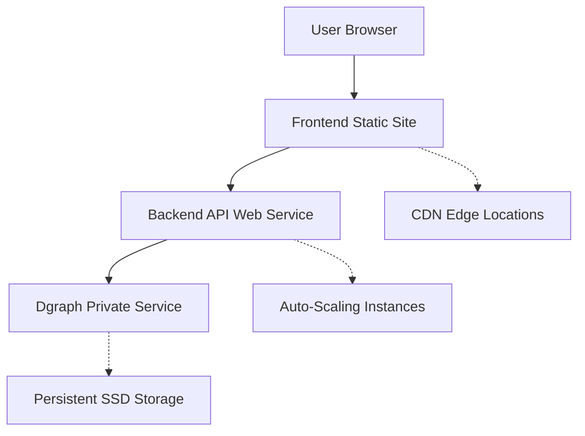

# 🚀 Infrastructure & Deployment Architecture

The system is designed for cloud deployment using containerized services with clear separation of concerns and scalable infrastructure.

## 🏗️ Render Services Architecture

We deploy three separate services on Render for production, providing a scalable and maintainable infrastructure.

| Component | Service Type | Description | Resources |
|-----------|--------------|-------------|-----------|
| **Frontend** | Static Site | React/Vite application | CDN + Edge caching |
| **Backend API** | Web Service | Node.js/Express server | Auto-scaling instances |
| **Dgraph Database** | Private Service | Graph database container | Persistent SSD storage |

## 🌐 Frontend Deployment (Static Site)

### **Service Configuration**
- **Service Type**: Static Site
- **Root Directory**: `/frontend`
- **Build Command**: `npm install && npm run build`
- **Publish Directory**: `dist`
- **Auto-Deploy**: Enabled on pushes to `main`

### **Build Process**
```bash
# Frontend build pipeline
cd frontend
npm install          # Install dependencies
npm run build        # Vite production build
# Output: dist/ directory with optimized static files
```

### **Environment Variables**
```bash
# Frontend production configuration
VITE_API_BASE_URL=https://mims-graph-api.onrender.com/api
```

### **Performance Optimizations**
- **Asset Optimization**: Vite automatically minifies and optimizes assets
- **Code Splitting**: Dynamic imports for optimal loading
- **CDN Distribution**: Global edge caching for static assets
- **Compression**: Gzip/Brotli compression for all assets

### **Custom Domain Setup**
```bash
# DNS Configuration (example for makeitmakesense.io)
Type: CNAME
Name: @
Value: your-app-name.onrender.com

# SSL Certificate
# Automatically provisioned by Render
```

## 🧠 Backend API Deployment (Web Service)

### **Service Configuration**
- **Service Type**: Web Service
- **Root Directory**: `/api`
- **Build Command**: `npm install`
- **Start Command**: `npm run start`
- **Auto-Deploy**: Enabled on pushes to `main`

### **Build Process**
```bash
# Backend build pipeline
cd api
npm install          # Install dependencies
npm run build        # TypeScript compilation (if configured)
npm run start        # Start Express server
```

### **Environment Variables**
```bash
# Production environment configuration
PORT=3000
DGRAPH_BASE_URL=http://mims-graph-dgraph:8080
ADMIN_API_KEY=secure-production-key-here
CORS_ORIGIN=https://makeitmakesense.io
ENABLE_MULTI_TENANT=true
DGRAPH_NAMESPACE_DEFAULT=0x0
DGRAPH_NAMESPACE_TEST=0x1
NODE_ENV=production
```

### **Auto-Scaling Configuration**
- **Minimum Instances**: 1
- **Maximum Instances**: 5 (configurable)
- **CPU Threshold**: 70% utilization
- **Memory Threshold**: 80% utilization
- **Scale-Up Delay**: 2 minutes
- **Scale-Down Delay**: 5 minutes

### **Health Checks**
```bash
# Render health check endpoint
GET /api/health

# Expected response
{
  "apiStatus": "OK",
  "dgraphStatus": "OK",
  "timestamp": "2024-01-01T00:00:00.000Z"
}
```

## 🗄️ Database Deployment (Private Service)

### **Service Configuration**
- **Service Type**: Docker (Private Service)
- **Dockerfile Path**: `Dockerfile.dgraph`
- **Build Context**: Repository root
- **Auto-Deploy**: Enabled on pushes to `main`

### **Docker Configuration**
```dockerfile
# Dockerfile.dgraph
FROM dgraph/dgraph:latest

# Copy initialization scripts
COPY docker/dgraph-entrypoint.sh /entrypoint.sh
COPY schemas/default.graphql /schema.graphql

# Set permissions
RUN chmod +x /entrypoint.sh

# Expose ports
EXPOSE 8080 9080

# Custom entrypoint
ENTRYPOINT ["/entrypoint.sh"]
```

### **Initialization Script**
```bash
#!/bin/bash
# docker/dgraph-entrypoint.sh

# Start Dgraph Zero (coordination service)
dgraph zero --my=zero:5080 &

# Start Dgraph Alpha (data service)
dgraph alpha --my=alpha:7080 --zero=zero:5080 &

# Wait for services to start
sleep 10

# Apply default schema
curl -X POST localhost:8080/admin/schema \
  -H "Content-Type: application/json" \
  -d @/schema.graphql

# Keep container running
wait
```

### **Persistent Storage**
- **Volume Mount**: `/dgraph` directory
- **Storage Type**: SSD persistent disk
- **Backup Strategy**: Daily automated backups
- **Size**: 10GB initial (auto-scaling available)

### **Network Configuration**
- **Internal URL**: `http://mims-graph-dgraph:8080`
- **Ports**: 8080 (GraphQL), 9080 (gRPC)
- **Access**: Private service (not publicly accessible)

## 🔧 Infrastructure Architecture

### **Service Dependencies**


### **Network Security**
- **Frontend**: Public access via HTTPS
- **Backend API**: Public API endpoints with CORS protection
- **Database**: Private service, no external access
- **Internal Communication**: Secure service-to-service communication

### **SSL/TLS Configuration**
- **Automatic HTTPS**: Render provides automatic SSL certificates
- **Custom Domains**: Support for custom domain SSL
- **TLS Version**: TLS 1.2+ enforced
- **HSTS**: HTTP Strict Transport Security enabled

## 🌍 Multi-Tenant Production Deployment

### **Tenant Isolation**
```bash
# Production tenant configuration
ENABLE_MULTI_TENANT=true
DGRAPH_NAMESPACE_DEFAULT=0x0      # Default tenant
DGRAPH_NAMESPACE_TEST=0x1         # Testing tenant
DGRAPH_NAMESPACE_PREFIX=0x        # Namespace prefix for new tenants
```

### **Enterprise Deployment**
For Dgraph Enterprise features:

```dockerfile
# Dockerfile.dgraph (Enterprise version)
FROM dgraph/dgraph-enterprise:latest

# Enterprise license configuration
ENV DGRAPH_LICENSE_KEY=your-enterprise-license-key

# Enable namespace support
ENV DGRAPH_ENTERPRISE_FEATURES=true
```

### **Tenant Management**
```bash
# Production tenant operations
curl -X POST https://your-api-url.onrender.com/api/tenant \
  -H "X-Admin-API-Key: your-production-admin-key" \
  -H "Content-Type: application/json" \
  -d '{"tenantId": "customer-production"}'
```

## 📊 Monitoring & Observability

### **Application Monitoring**
- **Health Checks**: Automatic service health monitoring
- **Uptime Monitoring**: 99.9% uptime SLA
- **Performance Metrics**: Response time and throughput tracking
- **Error Tracking**: Automatic error detection and alerting

### **Infrastructure Monitoring**
```bash
# Service metrics available via Render dashboard
- CPU usage per service
- Memory consumption
- Network I/O
- Storage utilization
- Request rate and latency
```

### **Custom Monitoring**
```typescript
// Application-level monitoring
app.use('/api/metrics', (req, res) => {
  res.json({
    uptime: process.uptime(),
    memory: process.memoryUsage(),
    timestamp: new Date().toISOString(),
    activeConnections: getActiveConnectionCount(),
    tenantCount: getTenantCount()
  });
});
```

### **Logging Strategy**
- **Structured Logging**: JSON format for easy parsing
- **Log Levels**: DEBUG, INFO, WARN, ERROR
- **Log Retention**: 30 days standard retention
- **Search & Analysis**: Full-text log search capabilities

## 🔒 Security Architecture

### **API Security**
- **CORS Configuration**: Strict origin validation
- **Rate Limiting**: API usage throttling
- **Input Validation**: Request payload sanitization
- **Admin Authentication**: Secure API key validation

### **Database Security**
- **Network Isolation**: Private service deployment
- **Access Control**: Admin-only database access
- **Data Encryption**: TLS encryption for all communications
- **Backup Encryption**: Encrypted backup storage

### **Environment Security**
```bash
# Secure environment variable management
# Never commit secrets to repository
# Use Render's secure environment variable storage

# Example secure configuration
ADMIN_API_KEY=${RENDER_SECRET_ADMIN_API_KEY}
DATABASE_URL=${RENDER_SECRET_DATABASE_URL}
```

## 🚀 Deployment Workflow

### **Continuous Deployment Pipeline**
1. **Code Commit**: Developer pushes to `main` branch
2. **Automatic Detection**: Render detects repository changes
3. **Build Process**: Each service builds independently
4. **Health Checks**: Services validate before deployment
5. **Rolling Deployment**: Zero-downtime deployment strategy
6. **Validation**: Post-deployment health verification

### **Rollback Strategy**
```bash
# Automatic rollback triggers
- Health check failures
- Build failures
- Service startup failures

# Manual rollback
# Available via Render dashboard
# One-click rollback to previous version
```

### **Blue-Green Deployment**
- **Production Environment**: Current live version
- **Staging Environment**: New version validation
- **Traffic Switching**: Instant traffic cutover
- **Validation Period**: Monitor new version performance

## 📈 Scaling Strategies

### **Horizontal Scaling**
- **Frontend**: CDN edge scaling (automatic)
- **Backend**: Multi-instance scaling (configurable)
- **Database**: Read replica scaling (manual)

### **Vertical Scaling**
- **Memory Allocation**: Per-service memory limits
- **CPU Allocation**: Per-service CPU limits
- **Storage Scaling**: Automatic storage expansion

### **Performance Optimization**
```typescript
// Backend optimization strategies
- Connection pooling for database connections
- Response caching for frequently accessed data
- Compression for API responses
- Background job processing for heavy operations
```

## 🔄 Backup & Recovery

### **Automated Backups**
- **Database Backups**: Daily automatic backups
- **Code Backups**: Git repository as source of truth
- **Configuration Backups**: Environment variable snapshots

### **Recovery Procedures**
```bash
# Database recovery
1. Identify backup timestamp
2. Create new service instance
3. Restore from backup
4. Update service configuration
5. Validate data integrity

# Service recovery
1. Rollback to previous deployment
2. Validate service health
3. Monitor for issues
4. Plan corrective deployment
```

### **Disaster Recovery**
- **RTO (Recovery Time Objective)**: 4 hours maximum
- **RPO (Recovery Point Objective)**: 24 hours maximum
- **Multi-Region Strategy**: Future enhancement
- **Data Replication**: Cross-region backup storage

## 🔧 Local Development Infrastructure

### **Docker Compose Setup**
```yaml
# docker-compose.yml
version: '3.8'
services:
  dgraph-zero:
    image: dgraph/dgraph:latest
    ports: ["5080:5080", "6080:6080"]
    command: dgraph zero --my=dgraph-zero:5080
    volumes: ["dgraph-data:/dgraph"]
    
  dgraph-alpha:
    image: dgraph/dgraph:latest
    ports: ["8080:8080", "9080:9080"]
    command: dgraph alpha --my=dgraph-alpha:7080 --zero=dgraph-zero:5080
    volumes: ["dgraph-data:/dgraph"]
    depends_on: [dgraph-zero]
    
  api:
    build: ./api
    ports: ["3000:3000"]
    environment:
      - DGRAPH_BASE_URL=http://dgraph-alpha:8080
      - ENABLE_MULTI_TENANT=true
    depends_on: [dgraph-alpha]
    
  frontend:
    build: ./frontend
    ports: ["5173:5173"]
    environment:
      - VITE_API_BASE_URL=http://localhost:3000/api
    depends_on: [api]

volumes:
  dgraph-data:
```

### **Development Commands**
```bash
# Start entire stack
docker-compose up -d

# View logs
docker-compose logs -f

# Reset database
docker-compose down -v
docker-compose up -d

# Scale services
docker-compose up -d --scale api=3
```

### **Development Environment Variables**
```bash
# api/.env (development)
PORT=3000
DGRAPH_BASE_URL=http://localhost:8080
ADMIN_API_KEY=development-key
CORS_ORIGIN=http://localhost:5173
ENABLE_MULTI_TENANT=true
NODE_ENV=development

# frontend/.env (development)
VITE_API_BASE_URL=http://localhost:3000/api
```

## 🔮 Future Infrastructure Enhancements

### **Advanced Deployment**
- **Kubernetes Migration**: Container orchestration
- **Multi-Region Deployment**: Global availability
- **Auto-Scaling Policies**: Advanced scaling rules
- **Circuit Breakers**: Fault tolerance patterns

### **Infrastructure as Code**
```yaml
# Example: Terraform configuration
resource "render_service" "frontend" {
  name = "mims-graph-frontend"
  type = "static_site"
  
  github {
    repository = "heythisisgordon/mims-graph"
    branch     = "main"
  }
  
  build_command      = "cd frontend && npm install && npm run build"
  publish_directory  = "frontend/dist"
}

resource "render_service" "api" {
  name = "mims-graph-api"
  type = "web_service"
  
  github {
    repository = "heythisisgordon/mims-graph"
    branch     = "main"
  }
  
  build_command = "cd api && npm install"
  start_command = "cd api && npm start"
  
  environment_variables = {
    NODE_ENV = "production"
    ENABLE_MULTI_TENANT = "true"
  }
}
```

### **Enhanced Monitoring**
- **Application Performance Monitoring (APM)**
- **Distributed Tracing**
- **Custom Metrics & Dashboards**
- **Predictive Scaling**

### **Container Orchestration**
```yaml
# kubernetes/deployment.yaml
apiVersion: apps/v1
kind: Deployment
metadata:
  name: mims-graph-api
spec:
  replicas: 3
  selector:
    matchLabels:
      app: mims-graph-api
  template:
    metadata:
      labels:
        app: mims-graph-api
    spec:
      containers:
      - name: api
        image: mims-graph-api:latest
        ports:
        - containerPort: 3000
        env:
        - name: DGRAPH_BASE_URL
          value: "http://dgraph-service:8080"
        - name: ENABLE_MULTI_TENANT
          value: "true"
        resources:
          requests:
            memory: "256Mi"
            cpu: "250m"
          limits:
            memory: "512Mi"
            cpu: "500m"
```

## 🚨 Troubleshooting Infrastructure

### **Common Deployment Issues**

#### **Build Failures**
```bash
# Check build logs
render logs --service=mims-graph-api --type=build

# Common causes:
- Node.js version mismatch
- Missing environment variables
- Dependency installation failures
- TypeScript compilation errors
```

#### **Service Communication Issues**
```bash
# Verify service URLs
curl https://mims-graph-api.onrender.com/api/health

# Check internal service communication
# From API service:
curl http://mims-graph-dgraph:8080/health

# Common causes:
- Incorrect service names
- Port configuration issues
- Network policy restrictions
```

#### **Database Connection Issues**
```bash
# Test Dgraph connectivity
curl http://localhost:8080/health

# Check Dgraph logs
docker logs dgraph-container

# Common causes:
- Dgraph not fully started
- Schema not loaded
- Namespace configuration issues
```

### **Performance Troubleshooting**
```bash
# Monitor resource usage
# API service metrics
curl https://mims-graph-api.onrender.com/api/metrics

# Database performance
curl http://localhost:8080/health | jq '.version'

# Frontend performance
# Chrome DevTools Network/Performance tabs
```

### **Security Troubleshooting**
```bash
# Verify SSL/TLS
curl -I https://makeitmakesense.io

# Test CORS configuration
curl -H "Origin: https://example.com" \
  https://mims-graph-api.onrender.com/api/health

# Validate API key authentication
curl -H "X-Admin-API-Key: invalid-key" \
  https://mims-graph-api.onrender.com/api/admin/status
```

## See Also

- **[System Architecture](./system-architecture)** - Complete system design and component details
- **[Multi-Tenant Guide](./multi-tenant-guide)** - Multi-tenant implementation and operations
- **[Setup Guide](./setup-guide)** - Local development environment setup
- **[API Endpoints](./api-endpoints)** - Complete API reference
- **[Testing Guide](./testing-guide)** - Testing strategies and development utilities

The infrastructure is designed for scalability, reliability, and ease of maintenance, supporting both development and production workloads with comprehensive monitoring and automated deployment capabilities.
